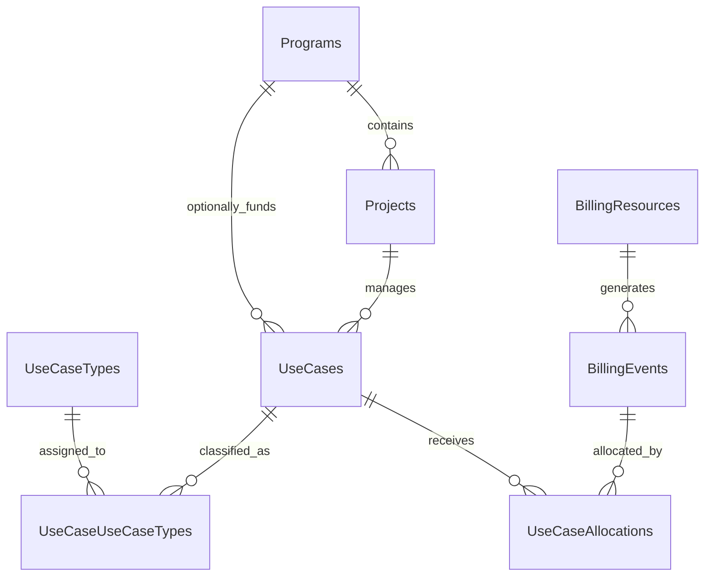
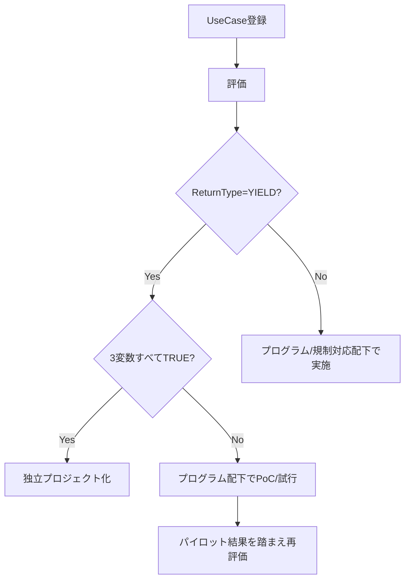

# ユースケース管理データモデル（最小版）

本ドキュメントは、データ利活用におけるユースケースをポートフォリオレベルで管理しつつ、  
プロジェクトマネジメントと明確に区別するための最小限のエンティティ・リレーションを定義する。

---

## 1. モデルの考え方

- **UseCases**  
  - 全ユースケースの台帳。ROI型/非ROI型問わず一元管理する。  
- **UseCaseTypes**  
  - ユースケースの利活用類型（例：ML訓練、BI可視化、統計分析 等）。  
- **UseCaseUseCaseTypes**  
  - UseCases と UseCaseTypes の多対多対応。  
- **Programs / Projects**  
  - 財源や推進単位を表す枠組み。  
  - ROI型ユースケースは独立プロジェクト化可能。  
  - 非ROI型ユースケース（Enablement/Compliance等）は、既存のプログラム/プロジェクトにサブセットとしてぶら下げる。  
- **BillingResources**  
  - クラウド/サービス上の課金対象リソースの台帳（Storage, Compute 等）。  
- **BillingEvents**  
  - 課金実績を表す事実テーブル（利用量、請求月、コスト等）。  
- **UseCaseAllocations**  
  - BillingEvents をユースケースへ配賦するためのブリッジ。  

---

## 2. エンティティ一覧

### UseCases
ユースケース本体。

| 列名 | 型 | 説明 |
|------|---|------|
| `use_case_id` | UUID / TEXT | 主キー |
| `title` | TEXT | ユースケース名 |
| `objective` | TEXT | ビジネス目的 |
| `status` | TEXT | 状態（Ideation, Build, Run, Retire 等） |
| `owner` | TEXT | ビジネス責任者 |
| `return_type` | ENUM | `YIELD`, `ENABLEMENT`, `RISK_REDUCTION`, `COMPLIANCE` |
| `can_quantify_return` | BOOLEAN | リターンを測定可能か |
| `can_estimate_return_ex_ante` | BOOLEAN | リターンを事前に予測可能か |
| `can_explain_return_mechanism` | BOOLEAN | リターンのメカニズムを説明可能か |
| `program_id` | FK→Programs | 親プログラム（任意） |
| `project_id` | FK→Projects | 親プロジェクト（任意） |
| `start_date` / `end_date` | DATE | 任意 |
| `created_at` / `updated_at` | TIMESTAMP | 監査用 |

---

3つのバイナリ変数の解釈と例はそれぞれ次のとおりである。

**can_quantify_return（測定可能性）**:
- 例：A/Bテストで解約率差を測れる → TRUE

**can_estimate_return_ex_ante（事前予測可能性）**:
- 例：工数削減による人件費削減を事前に試算できる → TRUE
- 例：レコメンド効果は利用状況に依存し予測困難 → FALSE

**can_explain_return_mechanism（メカニズム説明可能性）**:
- 例：ダッシュボード導入 → 手作業削減 → コスト削減 → TRUE
- 例：レコメンド導入で解約率が下がるが理由は不明 → FALSE

### UseCaseTypes
ユースケース類型のマスタ。

| 列名 | 型 | 説明 |
|------|---|------|
| `use_case_type_id` | UUID | 主キー |
| `code` | TEXT | 一意なコード（例：ML_TRAIN, BI_VIZ） |
| `name` | TEXT | 表示名 |
| `description` | TEXT | 説明 |
| `is_active` | BOOLEAN | 有効フラグ |

---

### UseCaseUseCaseTypes
ユースケースと類型の多対多対応。

| 列名 | 型 | 説明 |
|------|---|------|
| `use_case_id` | FK→UseCases | ユースケース |
| `use_case_type_id` | FK→UseCaseTypes | 類型 |
| `is_primary` | BOOLEAN | 主たる類型かどうか |

---

### BillingResources
課金対象リソースの台帳。

| 列名 | 型 | 説明 |
|------|---|------|
| `resource_id` | UUID | 主キー |
| `provider` | TEXT | クラウド/サービス提供者（例: Azure, Fabric, Databricks） |
| `service_name` | TEXT | リソース種別（Storage, Compute 等） |
| `sku` / `region` | TEXT | SKUやリージョンなどの識別子 |
| `tags` | JSON/TEXT | `use_case`, `env`, `cost_center` 等のメタデータ |
| `active_from` / `active_to` | DATE | 有効期間 |

---

### BillingEvents
課金実績の事実テーブル。

| 列名 | 型 | 説明 |
|------|---|------|
| `event_id` | UUID | 主キー |
| `resource_id` | FK→BillingResources | 課金リソース |
| `usage_start` / `usage_end` | DATE/TIMESTAMP | 利用期間 |
| `billing_month` | TEXT(YYYY-MM) | 請求月 |
| `usage_quantity` | DECIMAL | 使用量 |
| `usage_unit` | TEXT | 単位（GB, vCPU-Hour 等） |
| `cost` | DECIMAL | 課金額 |
| `charge_type` | TEXT | Usage, Purchase, Refund 等 |

---

### UseCaseAllocations
課金イベントをユースケースに配賦するブリッジ。

| 列名 | 型 | 説明 |
|------|---|------|
| `allocation_id` | UUID | 主キー |
| `event_id` | FK→BillingEvents | 課金イベント |
| `use_case_id` | FK→UseCases | 紐づくユースケース |
| `allocation_pct` | DECIMAL | 配賦率(0–1) |
| `allocated_cost` | DECIMAL | 配賦後のコスト |

---

### Programs
上位の推進プログラム（財源レベル）。

| 列名 | 型 | 説明 |
|------|---|------|
| `program_id` | UUID | 主キー |
| `name` | TEXT | プログラム名 |
| `description` | TEXT | 説明 |

---

### Projects
プロジェクト単位。

| 列名 | 型 | 説明 |
|------|---|------|
| `project_id` | UUID | 主キー |
| `name` | TEXT | プロジェクト名 |
| `description` | TEXT | 説明 |
| `program_id` | FK→Programs | 所属プログラム |

---

## 3. リレーション（Mermaid）

## 4. 推進フレームワーク上の位置付け

- ROI型（YIELD）ユースケース:
    - 独立したプロジェクト化が基本。専用予算を持ち、投資評価の対象とする。
- 非ROI型（Enablement, RiskReduction, Compliance）ユースケース:
    - ポートフォリオ管理上はUseCasesとして登録。
    - プロジェクトマネジメント上は既存プログラム／プロジェクトに紐づけ、サブプロジェクトまたはタスクとして扱う。
    - 財源は親プログラム／プロジェクトの予算を使用する。

===

## 5. ユースケースタイプ一覧

| コード | 名称 | 説明 |
|--------|------|------|
| BI_VIZ | BI Visualization | BIツールでの可視化、レポーティングを主とするユースケース |
| STAT_ANALYSIS | Statistical Analysis | 統計的手法を用いた分析（回帰、サバイバル解析等） |
| ML_TRAIN | Training Models | 機械学習モデルの訓練 |
| ML_DEPLOY | Deploying Services | 学習済みモデルやサービスのデプロイ、運用 |
| GENAI_PIPELINE | Streamlining Analysis Pipelines with GenAI | 生成AIを用いた分析パイプライン効率化 |
| ACTUARIAL | Actuarial Analysis | アクチュアリーによる数理分析（保険料率計算、リスク評価など） |

---

## 6. 標準RACIマトリクス（ユースケースタイプ別）

### RACIの定義
- **R (Responsible)**: 実務担当（実行責任を持つ）
- **A (Accountable)**: 説明責任を持つ（最終責任者）
- **C (Consulted)**: 相談・助言を行う
- **I (Informed)**: 情報共有を受ける

### Roles
- Data Engineer
- Business Analyst
- Cloud Infrastructure Engineer
- Backend Engineer
- Frontend Engineer
- Data Steward
- Data Owner
- Use Case Owner
- Data Scientist
- Solution Architect
- アクチュアリー

---

### 6.1 BI Visualization

| Role | 責任 |
|------|------|
| Data Engineer | C |
| Business Analyst | R |
| Cloud Infrastructure Engineer | I |
| Backend Engineer | I |
| Frontend Engineer | I |
| Data Steward | C |
| Data Owner | C |
| Use Case Owner | A |
| Data Scientist | C |
| Solution Architect | I |
| アクチュアリー | - |

---

### 6.2 Statistical Analysis

| Role | 責任 |
|------|------|
| Data Engineer | C |
| Business Analyst | C |
| Cloud Infrastructure Engineer | I |
| Backend Engineer | I |
| Frontend Engineer | I |
| Data Steward | C |
| Data Owner | C |
| Use Case Owner | A |
| Data Scientist | R |
| Solution Architect | C |
| アクチュアリー | I |

---

### 6.3 Training Models

| Role | 責任 |
|------|------|
| Data Engineer | C |
| Business Analyst | I |
| Cloud Infrastructure Engineer | C |
| Backend Engineer | C |
| Frontend Engineer | I |
| Data Steward | C |
| Data Owner | C |
| Use Case Owner | A |
| Data Scientist | R |
| Solution Architect | C |
| アクチュアリー | - |

---

### 6.4 Deploying Services

| Role | 責任 |
|------|------|
| Data Engineer | R |
| Business Analyst | I |
| Cloud Infrastructure Engineer | R |
| Backend Engineer | R |
| Frontend Engineer | C |
| Data Steward | I |
| Data Owner | C |
| Use Case Owner | A |
| Data Scientist | C |
| Solution Architect | C |
| アクチュアリー | - |

---

### 6.5 Streamlining Analysis Pipelines with GenAI

| Role | 責任 |
|------|------|
| Data Engineer | R |
| Business Analyst | C |
| Cloud Infrastructure Engineer | C |
| Backend Engineer | C |
| Frontend Engineer | C |
| Data Steward | C |
| Data Owner | C |
| Use Case Owner | A |
| Data Scientist | R |
| Solution Architect | C |
| アクチュアリー | - |

---

### 6.6 Actuarial Analysis

| Role | 責任 |
|------|------|
| Data Engineer | C |
| Business Analyst | I |
| Cloud Infrastructure Engineer | I |
| Backend Engineer | I |
| Frontend Engineer | I |
| Data Steward | C |
| Data Owner | C |
| Use Case Owner | A |
| Data Scientist | C |
| Solution Architect | C |
| アクチュアリー | R |

===

### 6.X 標準RACIマトリクス（拡張表）

| Role                         | BI Visualization | Statistical Analysis | Training Models | Deploying Services | GenAI Pipelines | Actuarial Analysis |
|------------------------------|------------------|----------------------|-----------------|--------------------|-----------------|--------------------|
| Data Engineer                | C                | C                    | C               | R                  | R               | C                  |
| Business Analyst             | R                | C                    | I               | I                  | C               | I                  |
| Cloud Infrastructure Engineer| I                | I                    | C               | R                  | C               | I                  |
| Backend Engineer             | I                | I                    | C               | R                  | C               | I                  |
| Frontend Engineer            | I                | I                    | I               | C                  | C               | I                  |
| Data Steward                 | C                | C                    | C               | I                  | C               | C                  |
| Data Owner                   | C                | C                    | C               | C                  | C               | C                  |
| Use Case Owner               | A                | A                    | A               | A                  | A               | A                  |
| Data Scientist               | C                | R                    | R               | C                  | R               | C                  |
| Solution Architect           | I                | C                    | C               | C                  | C               | C                  |
| アクチュアリー               | -                | I                    | -               | -                  | -               | R                  |

---

## 7. ユースケース開始判断フレームワーク

ユースケースを登録した後、実際にプロジェクト化またはプログラム配下で実行するかどうかを判断するための基準を整理する。

### 7.1 判断プロセス

1. **登録 (Ideation)**  
   - すべてのユースケースは `UseCases` に登録される。  
   - この段階では ReturnType や 3つのバイナリ変数（測定可能性・事前予測可能性・メカニズム説明可能性）を暫定的に付与する。

2. **評価 (Evaluation)**  
   - 以下の観点で評価を行う：
     - **ReturnType**: ROI型か非ROI型か  
     - **3変数の組み合わせ**:
       - 全て TRUE → 定量的ROI試算が可能 → 独立プロジェクト候補  
       - `can_estimate_return_ex_ante = FALSE` → ROI試算困難 → プログラム配下での試行的推進  
       - `can_explain_return_mechanism = FALSE` → メカニズム不明 → パイロット実施後に再評価  
     - **戦略整合性**: 経営戦略や規制要件との一致度  

3. **判断 (Decision)**  
   - **Go (実施)**: 独立プロジェクトとして予算化、または既存プログラム配下で推進。  
   - **Hold (保留)**: 技術的検証や追加情報待ち。  
   - **No-Go (却下)**: 投資対効果が乏しい、または戦略と不整合。

### 7.2 判断基準の例

| ReturnType | can_quantify_return | can_estimate_return_ex_ante | can_explain_return_mechanism | 推進の位置づけ |
|------------|---------------------|-----------------------------|------------------------------|----------------|
| YIELD      | TRUE                | TRUE                        | TRUE                         | 独立プロジェクト |
| YIELD      | TRUE                | FALSE                       | TRUE/FALSE                   | プログラム配下のPoC |
| ENABLEMENT | 任意                | 任意                        | 任意                         | プログラム配下で実施 |
| RISK_REDUCTION / COMPLIANCE | 任意 | 任意 | 任意 | 規制対応プログラムの一部として実施 |

### 7.3 判断プロセスの可視化

